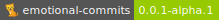

# Emotional commits

Emotional commits is a specification proposal for commit message and annotation format convention in Git.

## About

Emotional commits are heavily inspired by best practices based on Git generated commits, which are well summarized in [How to Write a Git Commit Message](https://chris.beams.io/posts/git-commit/) and two existing standards: [Conventional Commits](https://www.conventionalcommits.org/en/v1.0.0/) and [Gitmoji](https://gitmoji.carloscuesta.me).

The specification defines and gives recommendations for the structure of commit messages, including text format and metadata. The specification uses emoticons to categorize revisions, which provides an easy graphical aid to help non author developers to understand the purpose of the revision.

## The specification

Based on the research summarized in [motivation](./docs/motivation.md) I created a [RFC](./rfc/README.md) draft.

Haver some questions? I tried to answer a few in [Q&A](./docs/qa.md).

## Contributing

The project is at very early draft stage. Your attention and opinions are the most valuable help you can provide at the moment.

If you would like to contribute, please read this introduction as well as the specification carefully. That's the first step and is much appreciated.

- Do you know someone who might like it or be interested in taking part? Please let them know.
- Would you like to support the project and already told everyone who might be interested? Consider giving this repo a star.
- Do you have any questions, proposals, critique? I would love to hear them. Please create an issue in this repo, so we can discuss it publicly.
- Are you interested in becoming a maintainer, please write a brief motivation with you observations from the materials, your experience or your ideas and create an issue.

## License

This project is licensed under [MIT](./LICENSE).
